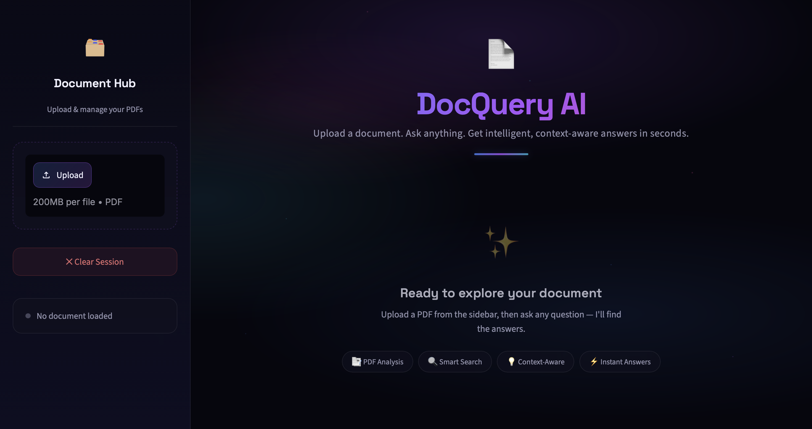
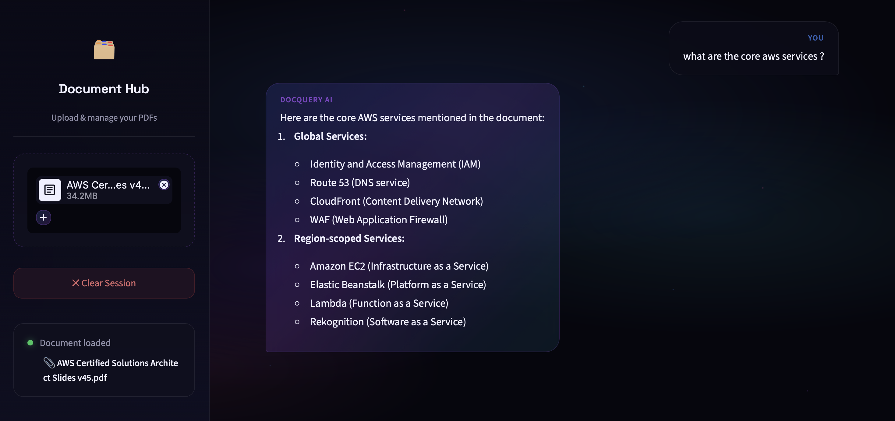

# 📄 DocQuery AI

**DocQuery AI** is an intelligent, session-isolated RAG (Retrieval-Augmented Generation) chatbot application designed to transform how you interact with PDF documents. Instead of searching by keywords or scrolling through massive files, you can converse directly with your documents in real time. 

Built with **Streamlit**, **LangChain**, **Chroma DB**, **HuggingFace**, and **Mistral AI**, it processes documents locally, indexes content into a fresh vector store per session, and enables instant semantic retrieval and answering.

---

## 📸 Interface Preview




---

## 🚀 Key Features

- **📂 Instant Document Processing:** Upload any PDF through a clean sidebar layout to process and chunk it on the fly.
- **🔄 Session-Isolated Database:** Uses an in-memory instance of Chroma DB. Every session is fresh, isolated, and completely private—no documents are persisted on disk unless configured.
- **🧠 Advanced Semantic Retrieval:** Implements HuggingFace embeddings combined with Maximal Marginal Relevance (MMR) retrieval to extract the most relevant contexts while keeping content diverse.
- **💬 Intelligent QA Chatbot:** Leverages Mistral AI's `mistral-small-latest` language model to summarize, synthesize, and answer questions accurately.
- **🧹 Single-Click Reset:** Clean up your chat history and memory instantly using the "Clear Session" option.

---

## 🛠️ Tech Stack

- **Frontend & UI:** [Streamlit](https://streamlit.io/)
- **LLM Engine:** [Mistral AI API](https://mistral.ai/)
- **RAG Framework:** [LangChain](https://www.langchain.com/)
- **Vector Database:** [Chroma DB](https://www.trychroma.com/) (In-memory)
- **Embeddings:** [HuggingFace Embeddings](https://huggingface.co/docs/transformers/index) (`sentence-transformers`)

---

## 💻 Setup & Installation

### Prerequisites

- Python 3.10 or higher
- Mistral AI API Key (Get one from [Mistral Console](https://console.mistral.ai/))

### 1. Clone the Repository
```bash
git clone https://github.com/coderashhar/Document.AI.git
cd Document.AI
```

### 2. Configure Environment Variables
Create a `.env` file in the root directory and add your Mistral API key:
```env
MISTRAL_API_KEY=your_mistral_api_key_here
```

### 3. Setup Virtual Environment
Create and activate your python virtual environment:
```bash
python3 -m venv .venv
source .venv/bin/activate  # On macOS/Linux
# .venv\Scripts\activate   # On Windows
```

### 4. Install Dependencies
```bash
pip install -r requirements.txt
```

### 5. Launch the Application
```bash
streamlit run app.py
```

---

## 📖 Usage Guide

1. Open your browser and navigate to the local address provided by Streamlit (typically `http://localhost:8502`).
2. Upload a PDF document in the left sidebar.
3. Once the green success banner appears ("Document processed successfully!"), type your question into the chat input box at the bottom.
4. Get concise, context-aware answers directly extracted from your document.
5. Hit **Clear Session** if you want to upload a different PDF and start a new conversation.
